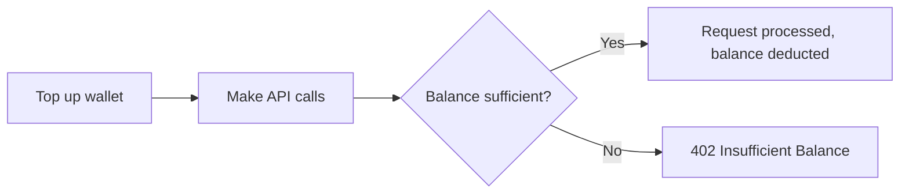

## Overview

The Cuttr API uses a **prepaid wallet** model. You add funds to your team's wallet, and each API call deducts a fixed amount based on the product used. No monthly subscriptions, no usage-based invoices — you always know what you'll pay.

## How billing works

Every API call that consumes a product (like clipping a video) deducts from your wallet:

| Product | Cost per unit |
|---------|---------------|
| AI Clipping (`clip_save`) | $0.50 per clip |
| Face Swap (`face_swap`) | $0.25 per second |

## Adding funds

Top up your wallet from the [dashboard](https://platform.cuttr.com/dashboard/api-platform) or via the [Top Up](/api-reference/endpoint/topup-wallet) endpoint. Minimum top-up is **$5.00**.

Payments are processed through Stripe. Your balance updates as soon as payment succeeds.

## Auto-refill

Never run out of balance by enabling auto-refill:

1. Make at least one top-up via Stripe checkout (this saves your payment method)
2. In the dashboard, toggle **Auto-Refill** on
3. Set a **threshold** (e.g., $5.00) and a **refill amount** (e.g., $25.00)

When your balance drops below the threshold after an API call, we automatically charge your saved card for the refill amount. The charge happens asynchronously — your API call still completes normally.

<Note>
  Auto-refill requires a saved payment method. Your card is saved automatically on your first Stripe checkout top-up.
</Note>

## Checking your balance

Use the [Get Wallet](/api-reference/endpoint/get-wallet) endpoint or check the dashboard to see:

- **Current balance** — what you can spend right now
- **Total spent** — cumulative API usage cost
- **Total topped up** — cumulative funds added

## What happens at zero balance

If your wallet hits zero:

- All API requests return `402 Insufficient Balance`
- Your API keys remain active — they'll work again as soon as you add funds
- If auto-refill is enabled, the refill is triggered automatically
